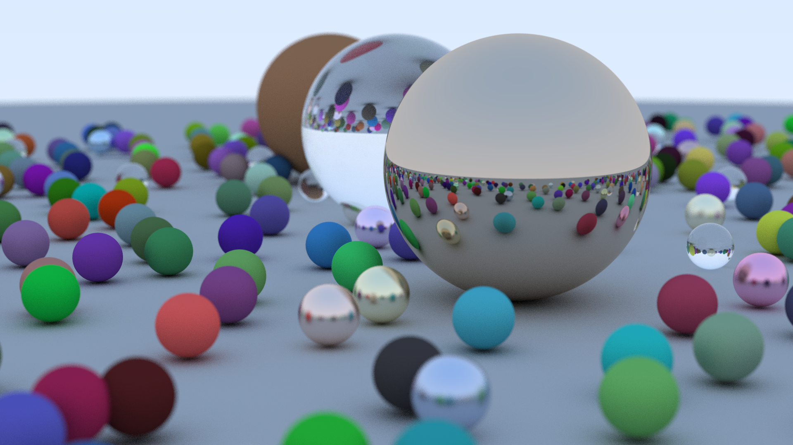

# Ray Tracing in One Weekend

This repository represents my trip through the book [Ray Tracing in One
Weekend].  I chose [Rust] as my implementation language, however I didn't go
out of the way to radically change the architecture of the code presented in
the book.  This means this is not really a stellar example of good Rust style,
but it is fully functional, and I believe slightly improved from the book's
C++.  Notably, I use `Option` rather than out parameters, but there are still
some functions which take way too many (primitive) arguments and the
home-rolled `Vec3` class is not great (but was a good learning experience).

[Ray Tracing in One Weekend]: https://amazon.com/dp/B01B5AODD8
[Rust]:                       https://www.rust-lang.org/
